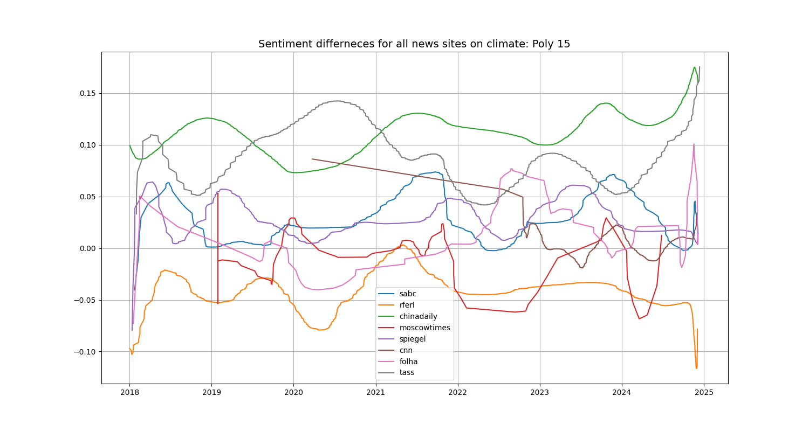

# lester
This is a tool for sentiment analysis on news sites
## Example result

## Setup
Python: 3.10.4
You can install all necessary packages with 
    
    pip install -r requirements.txt

## article_finder.py (crawler)
    python ./article_finder.py <key_word> <news_page> <news_page> ...

Example: 

    python ./article_finder.py my_topic all

this will fetch all articles until 01-01-2018 that were found using the internal search tool of the news sites.

Example: 

    python ./article_finder.py my_topic sabc rferl

this will fetch all articles until 01-01-2018 that were found using the internal search tool of rferl and sabc.

You can also exclude certain news sites:

Example: 

    python ./article_finder.py my_topic all rferl

this will fetch all articles until 01-01-2018 that contain were found using the internal search tool of all availabel news sites **but** rferl.

currently supported news pages are:

- sabc
- rferl
- chinadaily
- moscowtimes
- spiegel
- moscowtimes
- tass
- cnn (does not work perfectly)
- kyiv post (key_word: kyiv)
- Folha de S.Paulo (key_word: folha)
  
the key word 'all' will fetch results of all this pages

## sentiment_analyzer.py (sentiment analyzer and plotter)
    python ./sentiment_analyzer.py <key_word> <key_word> ...
    
optional arguments:

- offline
- cache
- all / \<news_site e.g. sabc\>

Example: 

    python ./sentiment_analyzer.py trees cache sabc

| key_word      | Description |
| ----------- | ----------- |
| offline      | Will not download any articles       |
| cache   | When set, no articles will be analyzed but the stored results will be used        |
| all   | All known news sites articles will be analyzed        |
| \<news site\>   | Just the named newssites will be analyzed or all webssites except the named ones when also adding "all"      |
